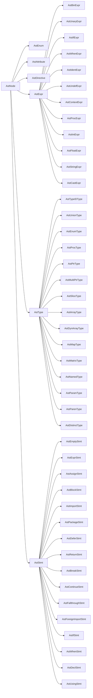

# Tree

```mermaid
flowchart LR
AstNode --> AstEnum
AstNode --> AstAttribute
AstNode --> AstDirective
AstNode --> AstExpr
AstNode --> AstType
AstNode --> AstStmt
AstExpr --> AstBinExpr
AstExpr --> AstUnaryExpr
AstExpr --> AstIfExpr
AstExpr --> AstWhenExpr
AstExpr --> AstIdentExpr
AstExpr --> AstUndefExpr
AstExpr --> AstContextExpr
AstExpr --> AstProcExpr
AstExpr --> AstIntExpr
AstExpr --> AstFloatExpr
AstExpr --> AstStringExpr
AstExpr --> AstCastExpr
AstType --> AstTypeIDType
AstType --> AstUnionType
AstType --> AstEnumType
AstType --> AstProcType
AstType --> AstPtrType
AstType --> AstMultiPtrType
AstType --> AstSliceType
AstType --> AstArrayType
AstType --> AstDynArrayType
AstType --> AstMapType
AstType --> AstMatrixType
AstType --> AstNamedType
AstType --> AstParamType
AstType --> AstParenType
AstType --> AstDistinctType
AstStmt --> AstEmptyStmt
AstStmt --> AstExprStmt
AstStmt --> AstAssignStmt
AstStmt --> AstBlockStmt
AstStmt --> AstImportStmt
AstStmt --> AstPackageStmt
AstStmt --> AstDeferStmt
AstStmt --> AstReturnStmt
AstStmt --> AstBreakStmt
AstStmt --> AstContinueStmt
AstStmt --> AstFallthroughStmt
AstStmt --> AstForeignImportStmt
AstStmt --> AstIfStmt
AstStmt --> AstWhenStmt
AstStmt --> AstDeclStmt
AstStmt --> AstUsingStmt
```